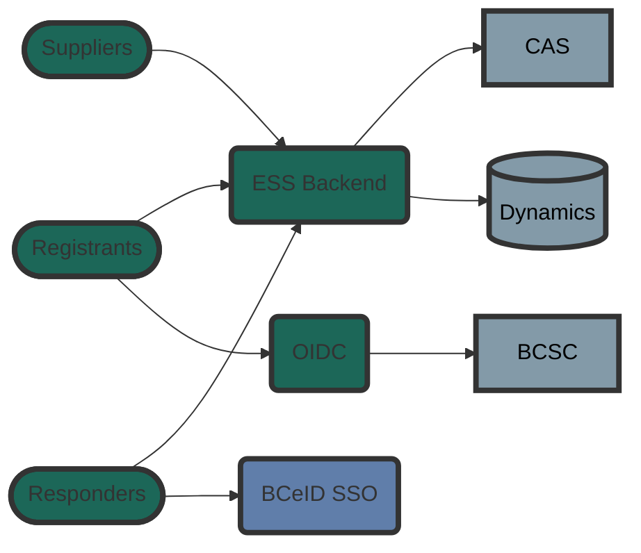
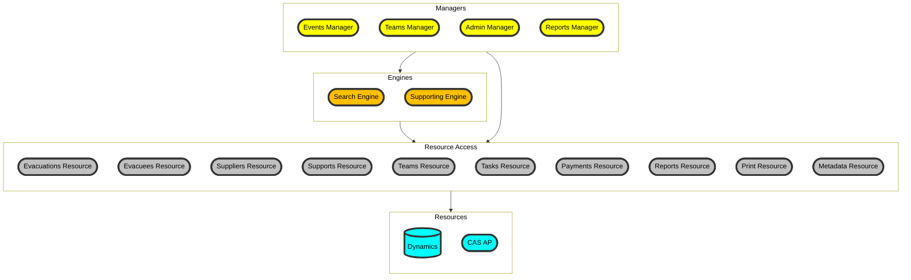

# DevHub Syntax Guide

This pages assumes you have read the [Content Partner Guide](../content-partner-guide/).

DevHub uses the [Backstage.io TechDoc framework](https://backstage.io/docs/features/techdocs/) and [mkdocs-techdocs-core](https://github.com/backstage/mkdocs-techdocs-core) plugin to display your documentation. The plugin contains a [number of extensions](https://github.com/backstage/mkdocs-techdocs-core?tab=readme-ov-file#mkdocs-plugins-and-extensions) you can use to format your documents.

This page gives an example of frequently used syntax. Refer to the above documentation for a complete list of options available to you.

Each section below will list the markdown and the resulting text.

## Mermaid


more complex diagram



another diagram



## Links

```markdown
This is a link to the [DevHub Content Partner Guide](content-partner-guide.md) page in the DevHub category.

This is a link to the [mermaid diagrams](content-syntax-guide.md#mermaid-diagrams) section within this page.

This is a link to the [Get help in Rocket.Chat](../rocketchat/get-help-in-rocketchat.md) page in the Rocket.Chat section.

This is a link to the [meetups](../../../mobile-developer-guide/meetups/) page in the Mobile Developer Guide. It is a page in another guide on DevHub. 

```

This is a link to the [DevHub Content Partner Guide](content-partner-guide.md) page in the DevHub category.

This is a link to the [mermaid diagrams](content-syntax-guide.md#mermaid-diagrams) section within this page.

This is a link to the [Get help in Rocket.Chat](../rocketchat/get-help-in-rocketchat.md) page in the Rocket.Chat section.

This is a link to the [meetups](../../../mobile-developer-guide/meetups/) page in the Mobile Developer Guide. It is a page in another guide on DevHub. 

## Lists

There must be a line break between the sentence and the start of the list. Use indents for nested lists. 

```markdown
This is a numbered list. Using the `1.` for all items will automatically number the list for you.

1. Item 1
1. Item 2
  1. Item 2a
  1. Item 2b
    1. Item 2bi
1. Item 3
  1. Item 3a
```

This is a numbered list. Using the `1.` for all items will automatically number the list for you.

1. Item 1
1. Item 2
  1. Item 2a
  1. Item 2b
    1. Item 2bi
1. Item 3
  1. Item 3a

Unordered lists can use either the `*` or `-` characters.

```markdown
This is an unordered list:

- Item 1
- Item 2
- Item 3
  - Item 3a
  - Item 3b
```

This is an unordered list:

- Item 1
- Item 2
- Item 3
  - Item 3a
  - Item 3b

!!! note
    Whitespace at the start of the top level items will prevent the list from being generated. 

This list will not display properly because it has whitespace in front of each top level item:   

```markdown
  - Item 1
  - Item 2
    - Item 2a
  - Item 3
```
 This list will not display properly because it has whitespace in front of each top level item:   

  - Item 1
  - Item 2
    - Item 2a
  - Item 3 

## Code 

Use three backticks for codeblocks. Provide the language to include syntax highlighting.

````markdown
```python
x = 2
if x == 1:
    print("x is 1.")
else:
    print("x is not 1")
```    
````

```python
x = 2
if x == 1:
    print("x is 1.")
else:
    print("x is not 1")
```

```
Use a single backtick for `inline code blocks`.
```

Use a single backtick for `inline code blocks`.


## Admonitions

Include two tabs of whitespace at the start of the text block for it to be included in the admonition block.

```markdown
!!! note
    Lorem ipsum dolor sit amet, consectetur adipiscing elit. Mauris faucibus elit vehicula, auctor turpis eget, tempus ligula. Vestibulum at lectus pellentesque magna interdum elementum. Sed luctus erat eget mi accumsan, nec interdum nulla dictum. In commodo ligula a porttitor elementum.

    Sed id dictum massa. Sed dolor libero, imperdiet hendrerit sollicitudin eu, euismod a arcu. Phasellus malesuada sagittis leo at fringilla. 
```

!!! note
    Lorem ipsum dolor sit amet, consectetur adipiscing elit. Mauris faucibus elit vehicula, auctor turpis eget, tempus ligula. Vestibulum at lectus pellentesque magna interdum elementum. Sed luctus erat eget mi accumsan, nec interdum nulla dictum. In commodo ligula a porttitor elementum.

     Sed id dictum massa. Sed dolor libero, imperdiet hendrerit sollicitudin eu, euismod a arcu. Phasellus malesuada sagittis leo at fringilla. 


Text blocks with no or 1 tab of whitspace will not be included in the admonition block.

```markdown
!!! info
  This text will not be in the admonition block. It will be below it.
```

!!! info
  This text will not be in the admonition block. It will be below it.

## Tabs


```markdown
=== "Tab 1"
    Tab 1 markdown content

    Lorem ipsum dolor sit amet, consectetur adipiscing elit. Mauris faucibus elit vehicula, auctor turpis eget, tempus ligula. Vestibulum at lectus pellentesque magna interdum elementum. Sed luctus erat eget mi accumsan, nec interdum nulla dictum. In commodo ligula a porttitor elementum.

=== "Tab 2"
    Tab 2 content.

    Lorem **ipsum** dolor sit amet, consectetur *adipiscing elit*.

    - item a
    - item b

    ```bash
    git commit -m "Initial commit"
    ```
```

=== "Tab 1"
    Tab 1 markdown content

    Lorem ipsum dolor sit amet, consectetur adipiscing elit. Mauris faucibus elit vehicula, auctor turpis eget, tempus ligula. Vestibulum at lectus pellentesque magna interdum elementum. Sed luctus erat eget mi accumsan, nec interdum nulla dictum. In commodo ligula a porttitor elementum.

=== "Tab 2"
    Tab 2 content.

    Lorem **ipsum** dolor sit amet, consectetur *adipiscing elit*.

    - item a
    - item b

    ```bash
    git commit -m "Initial commit"
    ```


## Images

Place your images in an `images` or `assets` folder. Link to them using markdown sytax. The text in the `[]` is the image's alt text.

```markdown

```


In this example the `example.drawio.svg` file was created with the [draw.io plugin for VSCode](https://www.drawio.com/blog/embed-diagrams-vscode). The format allows for image to be edited in the VSCode editor while displayed as an svg on the documentation page.


## Videos

YouTube vidoes can be embedded with the `iframe` command. Replace the `src` location with your video's url. 

Note: videos do not show when the [devhub-techdocs-publish](https://github.com/bcgov/devhub-techdocs-publish/blob/main/docs/index.md#how-to-use-the-docker-image-to-preview-content-locally) tool is used to preview the documentation locally.

```html
<iframe width="560" height="315" src="https://www.youtube.com/watch?v=-Tkqe0lRuE0" title="Introduction into GitOps and ArgoCD" frameborder="0" allow="accelerometer; autoplay; clipboard-write; encrypted-media; gyroscope; picture-in-picture" allowfullscreen></iframe>
```

<iframe width="560" height="315" src="https://www.youtube.com/watch?v=-Tkqe0lRuE0" title="Introduction into GitOps and ArgoCD" frameborder="0" allow="accelerometer; autoplay; clipboard-write; encrypted-media; gyroscope; picture-in-picture" allowfullscreen></iframe>
