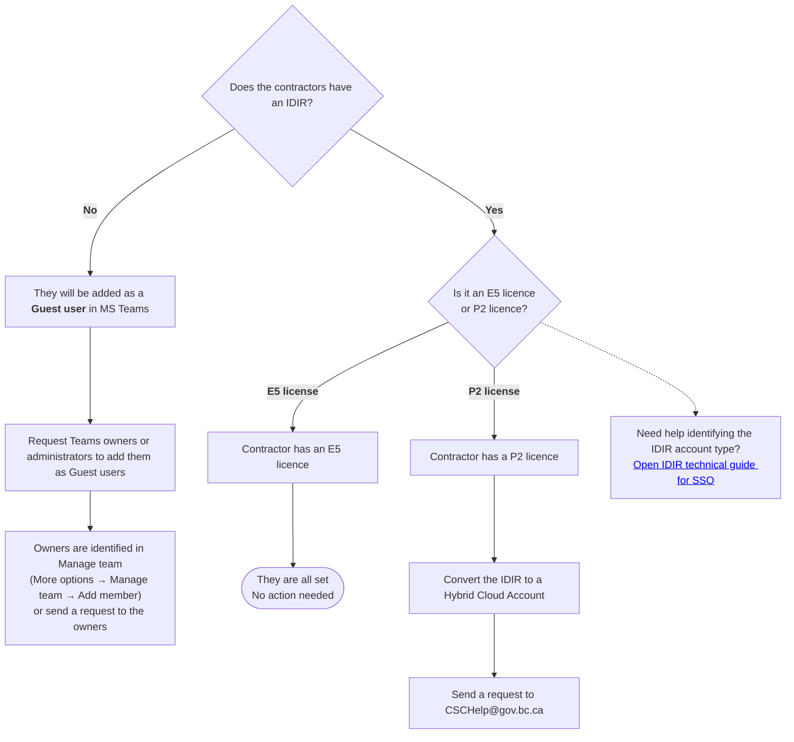

# Microsoft Teams access for contractors

## Overview

Access to Microsoft Teams for contractors depends on whether the other features of an IDIR account are required for their role. Note that contracted developers who want to use GitHub organizations [bcgov](https://github.com/bcgov) / [bcgov-c](https://github.com/bcgov-c) will require a P2 or higher IDIR. For more information visit the [IDIR and technical guide for SSO](../use-github-in-bcgov/github-transition-guide.md)

## Contractors with IDIR accounts

!!! info "Identify your IDIR account"
    To identify the IDIR account type visit [IDIR and technical guide for SSO](../use-github-in-bcgov/github-transition-guide.md#compatible-idirs-for-contractors), under section: Compatible IDIRs for contractors.

### Contractors who already have IDIR (with an E5 Licence)

Contractors with E5 licences get the same access as government staff. Use the same process to add them. By default, they can access any site that uses “Everyone except Guests” permissions.

### Contractors who already have IDIR (without an E5 Licence)

Contractors who already have an IDIR account but do not have an E5 licence need to complete these steps:

**Step 1: Associate an external email address** 

Ask an authorized requestor to submit an **Associate an IDIR with an external email address** request through My Service Centre.

**Step 2: Request hybrid cloud conversion**

Email CSCHelp@gov.bc.ca and ask to convert the IDIR account to a [Hybrid Cloud account](https://ociomysc.service-now.com/now/knowledge-center/kb_view/kb_knowledge/83745ccb33d376107f71fe282e5c7b29).

This conversion gives the contractor one identity to access B.C. government resources. It also lets them use their existing organization login to access Microsoft Teams and SharePoint.

## New contractors without IDIR accounts 

**New** contractors who need an IDIR ordered will need to:

**Step 1: Order an IDIR account (without E5 licence)**

Submit an onboarding request through **My Service Centre** for an IDIR account and include the contractor's external email address in the request details. 

**Step 2: Request hybrid cloud conversion**

Email CSCHelp@gov.bc.ca and ask convert the IDIR account to a [Hybrid Cloud account](https://ociomysc.service-now.com/now/knowledge-center/kb_view/kb_knowledge/83745ccb33d376107f71fe282e5c7b29).

This conversion gives the contractor one identity to access B.C. government resources. It also lets them use their existing organization login to access Microsoft Teams and SharePoint.

## Existing contractors without IDIR accounts 

Contractors without an IDIR account can join Microsoft Teams as **guest users**. They do not get access to IDIR features. When their contract ends, the service team that gave them initial access must remove their access manually.

* Teams owners and administrators can manage guest users the same way they manage internal users
* Guest users stay active after the contract end date because the system does not remove them automatically
* IDIR accounts deactivate automatically when they expire. However, all guest accounts need manual removal

For help with external guest accounts, email MFA@gov.bc.ca.

!!! warning "Important considerations" 
    * Guest access in Microsoft Teams is currently available at no cost. This process may change in the future
    * All service teams need to have an offboarding procedure for Microsoft Teams channels as all guest accounts need to be removed manually. Refer to [Developer Community Microsoft Teams guide](../developer-community/developer-community-ms-teams-guide.md#how-the-developer-community-is-structured) for more guidance.

## Easy flowchart guide

## Related information
* [Developer Community Microsoft Teams guide](../developer-community/developer-community-ms-teams-guide.md)
* [Developer Community participation guidelines](../developer-community/participation-guidelines.md)
* [Acceptance criteria for public channels in the Developer Community](../developer-community/acceptance-criteria.md)
