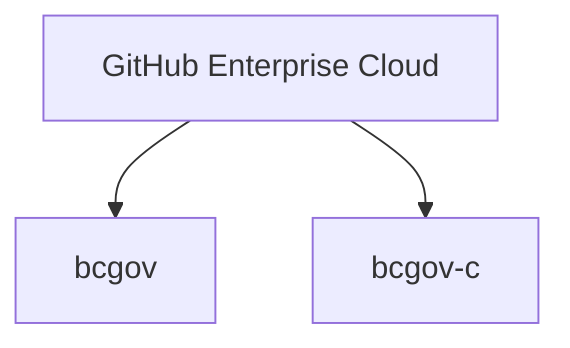

# B.C. Government organizations in GitHub

The [Digital Principles for B.C. Government](https://www2.gov.bc.ca/gov/content/governments/policies-for-government/core-policy/policies/im-it-management#12.1.1.5) supports and encourages product teams to work in the open. GitHub **(GH)** is the leading platform for open-source projects and collaboration. 

With GiHub Enterprise Cloud, we can:
   - Collaborate with the open-source community to build software
   - Support innvation
   - Share code and best practices 
   - Track issues and feature requests
   - Use tools for team and project management
   - Save costs and time

The Developer Experience team manages B.C. Government's GitHub environments. For questions, concerns, or feedback, please [submit a support request]( https://citz-do.atlassian.net/servicedesk/customer/portal/2).

For users who need quick access to common topics related to using GitHub in B.C. Government, please see the [GitHub for B.C. Government quick reference guide](docs/sample-govorginGH-quickref.md) instead of this doc. 

## Organizations in GitHub

We have two GitHub organizations **(org)**: `bcgov` and `bcgov-c`: 

On July 2024, we enabled [GitHub Single Sign-On (SSO)](#single-sign-on) for `bcgov`. For `bcgov-c`, we enabled on August 2024. 

Now, all members must be authenticated with IDIRs, including contractors. To request membership in any of these organizations, [follow the SSO enablement instructions](https://developer.gov.bc.ca/docs/default/component/bc-developer-guide/use-github-in-bcgov/bc-government-organizations-in-github/#directions-to-sign-up-and-link-your-account-for-bcgov).

### `bcgov`

the `bcgov` org hosts public repositories **(repos)** and has over 1000 repos. Each one holds hold open-source code, public documents, and inner-source contribution models developed by B.C. government teams. 

All repos in this org must be public to align with our Digital Principles. Anyone with membership can create repos. 

### `bcgov-c`

We use `bcgov-c` for **private** repos with confidential code and documents. If a team needs a location for private code, or is working to make code public, this is the right org.

Only the Developer Experience team can create repos in `bcgov-c`. To request a repo, please [submit a support request](https://citz-do.atlassian.net/servicedesk/customer/portal/2/group/9/create/60).

### Security features for both organizations

Please keep in mind that application and code security are complex. The [Security and Privacy Guidance](https://developer.gov.bc.ca/docs/default/component/bc-developer-guide/security/security-and-privacy-compliance-and-guidance/) and [Security best practices for apps](https://developer.gov.bc.ca/docs/default/component/bc-developer-guide/security/best-practices-for-apps/) docs can offer more comprehensive guidance. 

Both orgs come with various security features to protect repos and its code. We've highlighted some prominent features and best practices below.

#### Costs

**`bcgov`:** no cost for security features because all repos are public. GH gives them free for public repos.

**`bcgov-c`**: cost for security features because GH charges a fee for private repos. **But** the Developer Experience team covers cost **without** cost recovery.

#### Prominent features

* **Code scanning:** scans code for security vulnerabilities and coding errors.

* **Secret scanning:** scans repos and commits for sensitive information like API keys, passwords, and other secrets.

* **Dependabot:** scans repos for outdated or vulnerable dependencies and provides recommendations for fixing problems, including via automated PRs.

#### Best practices

* **Keep features enabled in repos**. Even if some can be reconfigured at the repo level, they're there the team secure code. 

* **Use the GH [Security Overview page](https://github.com/orgs/bcgov/security/overview)** to check any detected issues for repos, especially if working on multiple repos.

* **Take action on any issue surfaced by security features immediately**. Quick action - even if false positives - can stop big problems or becoming "noise" to ignore. 

## Single Sign-On

Because IDIRs are mandatory both organizations, we have created an [IDIR guide](github-transition-guide.md). We've also included contractor-specific instructions. Please note that IDIR order completion can take **several** days.

If the instructions and troubleshooting help below doesn't resolve your issue, please [submit a support request]( https://citz-do.atlassian.net/servicedesk/customer/portal/2).

### Security Insights for GitHub Enterprise-linked organizations

All orgs linked to the corporate GitHub Enterprise accounts have access to the Security Insight feature, inclusive of branch protection and code owners for private repos.

Branch protection allows specified members to push to the protected branch. The code owners feature allows automated reviews. For example, if a member is a code owner of certain files, they'll automatically be added as pull request **(PR)** reviewers. PRs need their approval before the code can be merged.

### Directions to sign up and link your account for `bcgov`

1. Have any two-factor device, and personal GitHub login and IDIR login ready.
2. Log into GitHub with your personal login. 
3. [Authenticate your IDIR](https://github.com/orgs/bcgov/sso)
4. You'll get an email with an invitation to join the `bcgov` GitHub organization. The invitation will be sent to the email address associated with your GitHub account.
    a. Refer to the [troubleshooting](#troubleshooting) section if you didn't receive an email.
5. Your teammates can add you to your team's repositories. We recommend teams use [GitHub teams](https://docs.github.com/en/organizations/organizing-members-into-teams/about-teams) to manage access.
6. [Authorize your personal access tokens and/or SSH keys](github-transition-guide.md#resetting-github-keys).

That’s it, your accounts are now joined. 
 
### Directions to sign up and link your account for `bcgov-c` 

A similar process applies for 'bcgov-c'.

1. Have any two-factor devices, and personal GitHub login and IDIR login ready.
1. Log into GitHub with your personal login. 
1. [Authenticate your IDIR](https://github.com/orgs/bcgov-c/sso)
1. You'll get an email with an invitation to join the **bcgov-c** GitHub organization. The invitation will be sent to the email address associated with your GitHub account.
  1. Refer to the [troubleshooting](#troubleshooting) section if you didn't receive an email.
1. Your teammates can add you to your team's repositories. We recommend teams use [GitHub teams](https://docs.github.com/en/organizations/organizing-members-into-teams/about-teams) to manage access.
1. [Re-authorize your personal access tokens and/or SSH keys](github-transition-guide.md#resetting-github-keys).

That’s it, your accounts are now joined.  

### SSO video demo

<iframe 
  width="560" 
  height="315" 
  src="https://www.youtube.com/embed/-cfhUY_or8s?si=vc3HjvHXlMRy7xcy" 
  title="Video title" 
  frameborder="0" 
  allow="accelerometer; autoplay; clipboard-write; encrypted-media; gyroscope; picture-in-picture" 
  allowfullscreen>
</iframe>

### Troubleshooting

If you didn't get an email invitation to join either organizations, you can check your organization status and invites:

1. Go to [https://github.com](https://github.com)
1. Sign in with the account used to join the [bcgov](#directions-to-sign-up-and-link-your-account-for-bcgov) or [bcgov-c](#directions-to-sign-up-and-link-your-account-for-bcgov-c) organization
1. Click on your profile picture
1. Choose the "Your organizations" option from the menu
1. Confirm the bcgov and/or bcgov-c organization is listed under the "Organizations" page
1. Click the "Accept" button next to the organization

