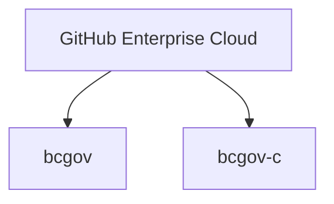

# B.C. Government organizations in GitHub

The [Digital Principles for B.C. Government](https://www2.gov.bc.ca/gov/content/governments/policies-for-government/core-policy/policies/im-it-management#12.1.1.5) urge product teams to work in the open. GitHub is the leading platform for open-source projects. It lets our organization work with the open-source community to build software, support innovation and save time and money. 

Using GitHub, teams can:

* Collaborate with the open-source community
* Share and control code versions
* Use tools for team and project management
* Integrate automation tools
* Track issues

B.C. Government's main organization is [bcgov](https://github.com/bcgov), where we store open code developed by government teams. It includes projects that have open-source and inner-source contribution models. `bcgov` has over 1000 repositories. 

We also have the `bcgov-c` organization, where developers can store confidential code.

On behalf of the B.C. Government, the Developer Experience Team manages government GitHub environments. For any questions or concerns, please [submit a support request]( https://citz-do.atlassian.net/servicedesk/customer/portal/2).

## Organizations in GitHub

Recently, we enabled [Single Sign-On (SSO)](#single-sign-on) for `bcgov` and on **August 27, 2024**, we'll enable SSO for `bcgov-c`. The transition helped us understand user needs better, and streamline services.  

Now, we use GitHub Enterprise Cloud, and it hosts the `bcgov` and `bcgov-c` GitHub organizations: 

### `bcgov`

The `bcgov` organization contains public repositories that hold open-source code or public documents developed by B.C. government teams. This organization is **public**.  To align with our Digital Principles, repositories should be hosted in this open repo. The only exception is strong rationale from your Ministry Security Information Officer.

* Any member of the `bcgov` organization can create repositories.

### `bcgov-c`

The `bcgov-c` organization stores private repositories with confidential source code and documents. This repository is **private**.

* Use this repository if you need a location for private code, or if you're working towards making the code public.
* Only the Developer Experience team can create repositories in this organization.
    * Request a repository by [submitting a request](https://github.com/BCDevOps/devops-requests/issues/new?assignees=MonicaG%2C+oomIRL&labels=github-repo%2C+pending&projects=&template=github_repo_request.md&title=).

## Single Sign-On 

To keep access to repositories in the `bcgov` and 'bcgov-c' organizations, all users must be authenticated with IDIRs. Contractors and employees without IDIRs must order one before SSO can be enabled. 

Learn more about IDIRs and post-authentication steps in [our guide](https://dev.developer.gov.bc.ca/docs/default/component/bc-developer-guide/use-github-in-bcgov/github-transition-guide/). 
  
### Directions to link your account

If you are a contractor without an IDIR, follow the steps in the [our guide](github-transition-guide.md#idirs) before proceeding.

1. [Authenticate your IDIR](https://github.com/orgs/bcgov/sso)
2. You'll get an email with an invitation to join the **bcgov** GitHub organization. The invitation will be sent to the email address associated with your GitHub account.
3. Your teammates can add you to your team's repositories.
4. [Re-authorize your personal access tokens and/or SSH keys](github-transition-guide.md#resetting-github-keys).

[Learn more about IDIRs](github-transition-guide.md). 
 
### SSO timelines for `bcgov-c`

We began transition of [`bcgov-c`](#bcgov-c) into Enterprise GitHub on **August 27, 2024**. After migration completes, we'll enable SSO for [`bcgov-c`](#bcgov-c) on **August 21, 2024**, using the same process as the SSO enablement for `bcgov`.

### SSO timelines for 'bcgov-ent'

For current B.C. Government private organizations part of the legacy `bcgov-ent` Enterprise implementation, we’ll work with your respective Information Management Branches and Information Systems Branches to identify next steps.

#### Directions to link IDIRs to GitHub IDs

The video shows the process, starting from the banner link on the bcgov GitHub organization, to the end:

<iframe width="560" height="315" src="https://www.youtube.com/embed/-cfhUY_or8s?si=q0pjaxYd4FBhNZ0s" title="YouTube video player" frameborder="0" allow="accelerometer; autoplay; clipboard-write; encrypted-media; gyroscope; picture-in-picture; web-share" referrerpolicy="strict-origin-when-cross-origin" allowfullscreen></iframe>

##### For employees 

1. Have any two-factor devices, and personal GitHub login and IDIR login ready. 
2. Log into GitHub and follow the prompts on the pop up to connect your GitHub and IDIR accounts together. 
3. [Re-authorize your personal access tokens and/or SSH keys](github-transition-guide.md#resetting-github-keys).

That’s it, your accounts are now joined.  

##### For contractors 

Contractors without IDIRs can find more information on our [IDIR transition guide](github-transition-guide.md#idirs). It can take several days to complete depending on your ministry. We recommend doing with this step as soon as possible to avoid access disruptions.  

After getting an IDIR, follow the steps below: 

1. Have any two-factor device, and personal GitHub login and IDIR login ready.
2. Log into GitHub and follow the prompts on the pop up to connect your GitHub and IDIR accounts together. 
3. If joining fails, your IDIR configuration is not compatible with our GitHub SSO. You must [request an upgrade to a P2 level IDIR account](github-transition-guide.md#idirs).  
4. [Re-authorize your personal access tokens and/or SSH keys](github-transition-guide.md#resetting-github-keys).

That’s it, your accounts are now joined. 
 
### Resources 
 
For more supplementary information, please see [our guide](github-transition-guide.md).  
 
For help with access, please [submit a support request]( https://citz-do.atlassian.net/servicedesk/customer/portal/2). 

## Security Insights for GitHub Enterprise-linked organizations

The Security Insight feature is available for all organizations linked to the corporate GitHub Enterprise accounts, as well as branch protection and code owners for private repositories. Branch protection only allows specific people to push to the protected branch. The code owners feature allows automated reviews. For example, if a specific user is a code owner of certain files they are automatically added as PR reviewers and their approval is required before the code can be merged.
