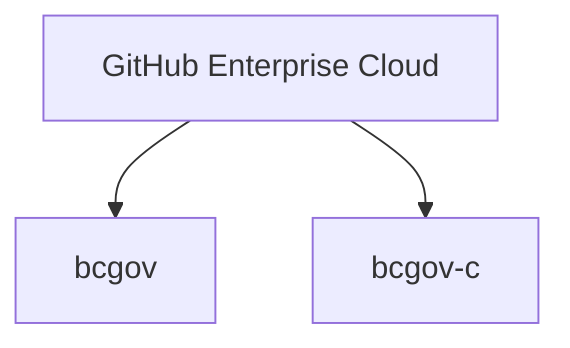

# B.C. Government organizations in GitHub

The [Digital Principles for the Government of B.C.](https://www2.gov.bc.ca/gov/content/governments/policies-for-government/core-policy/policies/im-it-management#12.1.1.5) urge product teams to work in the open. GitHub is the leading platform for open-source projects. It allows our organization to collaborate with the open-source community to build software, support innovation and save time and money. Using GitHub, teams can:

* Collaborate with the open-source community
* Share and control code versions
* Use tools for team and project management
* Integrate automation tools
* Track issues

B.C. Government's main organization is [bcgov](https://github.com/bcgov), where we store all open-source code developed by government teams. The `bcgov` organization includes over 1000 repositories. We also have the `bcgov-c`organization, where developers can either permanently or temporarily store confidential code. 

On behalf of the B.C. Government, the Developer Experience Team manages government GitHub environments.

## Organizations in GitHub

We use GitHub Enterprise Cloud, and it hosts the `bcgov` and `bcgov-c` GitHub organizations: 

Both organizations require users to enable [Single Sign-on](## Single sign-on).

### `bcgov`

The `bcgov` organization contains public repositories that hold open-source code or public documents developed by B.C. government teams. This organization is **public**.  To align with our Digital Principles, repositories should be hosted in this open repo, unless you have strong rationale from your Ministry Security Information Officer. 

* Product teams working in the B.C. Government Private Cloud PaaS OpenShift platform should use this organization, unless they are given permission to work in [`bcgov-c`](#bcgov-c)
* Any member of the `bcgov` organization can create repositories

### `bcgov-c`

The `bcgov-c` organization stores permanent, private repositories with confidential source code and documents. This repository is **private**.

* Use this repository if you need a permanent location for code, or if you're collecting approvals to make the code public.
* Only the Developer Experience team can create repositories in this organization.
    * Request a repository by [submitting a request](https://github.com/BCDevOps/devops-requests/issues/new?assignees=MonicaG%2C+oomIRL&labels=github-repo%2C+pending&projects=&template=github_repo_request.md&title=).

## Single Sign-On 

To keep access to the bcgov GitHub organization, all users must be authenticated. Contractors without IDIRs must order one before SSO can be enabled. 

[Learn more about IDIRs](https://dev.developer.gov.bc.ca/docs/default/component/bc-developer-guide/use-github-in-bcgov/github-transition-guide/). 
  
 
### Directions to link your account

If you are a contractor without an IDIR, follow the steps in the [IDIR transition guide](github-transition-guide.md#idirs) before proceeding:
 
1. Once you have access again, your teammates with admin access may need to re-invite you to the repositories you had access to before.  
2. Reauthorize your personal access tokens and/or SSH keys so they continue to work with SSO enabled.
    - [Learn more about how to do this](github-transition-guide.md#resetting-github-keys). 
 
### Upgrading bcgov-c 

We begin transition of [`bcgov-c`](#bcgov-c) into Enterprise GitHub on **August 7, 2024**. After migration completes, we'll enable SSO for [`bcgov-c`](#bcgov-c) on **August 21, 2024**, using the same process as the SSO enablement for `bcgov`.
  
For current B.C. Government private Enterprise organizations, we’ll work with your respective Information Management Branches and Information Systems Branches to identify next steps  

#### Directions to link IDIRs to GitHub IDs

The video shows the process, starting from the banner link on the bcgov GitHub organization, to the end:

<iframe width="560" height="315" src="https://www.youtube.com/embed/-cfhUY_or8s?si=q0pjaxYd4FBhNZ0s" title="YouTube video player" frameborder="0" allow="accelerometer; autoplay; clipboard-write; encrypted-media; gyroscope; picture-in-picture; web-share" referrerpolicy="strict-origin-when-cross-origin" allowfullscreen></iframe>

##### For employees 

1. Have any two-factor devices, and personal GitHub login and IDIR login ready for linking 
2. Log into GitHub and follow the prompts on the pop up to connect your GitHub and IDIR accounts together. 
3. Reauthorize your personal access tokens and/or SSH keys so they continue to work with SSO enabled.

    - [Learn more about how to do this](github-transition-guide.md#resetting-github-keys). 

That’s it, your accounts are now linked.  

##### For contractors 

Contractors without IDIRs can find more information on our [IDIR transition guide](github-transition-guide.md#idirs). It can take several days to complete depending on your ministry. We recommend doing with this step as soon as possible to avoid access disruptions.  

After getting an IDIR, follow the steps below: 

1. Have any two-factor device, and personal GitHub login and IDIR login ready for linking 
2. Log into GitHub and follow the prompts on the pop up to connect your GitHub and IDIR accounts together. 
3. If linking fails, your IDIR configuration is not compatible with our GitHub SSO. You must [request an upgrade to a P2 level IDIR account](github-transition-guide.md#idirs).  
4. Reauthorize your personal access tokens and/or SSH keys so they continue to work with SSO enabled.
    - [Learn more about how to do this](github-transition-guide.md#resetting-github-keys). 

That’s it, your accounts are now linked. 
 
### Resources 
 
For more supplementary information, please see our [transition guide](github-transition-guide.md).  
 
For help with access, please [submit a support request]( https://citz-do.atlassian.net/servicedesk/customer/portal/2). 

## Security Insights for GitHub Enterprise-linked organizations

The Security Insight feature is available for all organizations linked to the corporate GitHub Enterprise accounts, as well as branch protection and code owners for private repositories. Branch protection only allows specific people to push to the protected branch. The code owners feature allows automated reviews. For example, if a specific user is a code owner of certain files they are automatically added as PR reviewers and their approval is required before the code can be merged.
