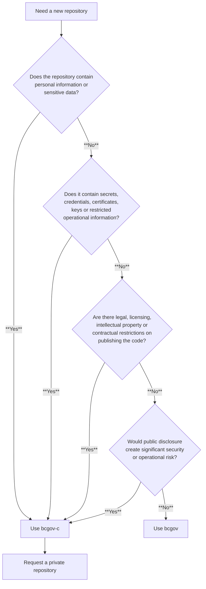

# Choosing between bcgov and bcgov-c organizations 

## Overview

The [Digital Code of Practice](https://digital.gov.bc.ca/design/dcop/) for the B.C. government encourages product teams to work in the open. Working in the open supports transparency, reuse, collaboration and external review.  

Create repositories in the public **bcgov** GitHub organization unless there is a specific reason to restrict public access. 

Use the **bcgov-c** GitHub organization for repositories that require restricted access because of security, privacy, legal, contractual or operational considerations. 

## Quick decision guide 

**Use bcgov (public) if:**

- The repository contains application source code, scripts, libraries, documentation, templates or configuration that can be publicly shared 
- The repository does not contain sensitive information 
- The repository aligns with B.C. government's open source and [Working in the Open](https://digital.gov.bc.ca/design/dcop/open/) principles 
- Other teams, governments, vendors or members of the public could potentially reuse the code

Examples include: 

- Web applications 
- APIs 
- Shared libraries 
- Infrastructure modules intended for reuse 
- Documentation sites 
- GitHub Actions 

**Recommended validation before publishing**

Before you create or move a repository into the public **bcgov** organization:

- Remove secrets and credentials 
- Enable GitHub secret scanning where available 
- Confirm that the repository does not contain personal information  
- Confirm repository ownership and licensing 
- Check for contractual restrictions 
- Add a README file 
- Add an appropriate [open-source license](https://developer.gov.bc.ca/docs/default/component/bc-developer-guide/use-github-in-bcgov/license-your-github-repository/)
- Enable security scanning tools where available 

**Use bcgov-c (private) if:**

- The repository contains information that cannot be publicly disclosed 
- The repository contains operational information that must remain restricted 
- Legal, contractual, security or privacy requirements limit who can access the repository 

Examples include: 

- The repositories containing protected operational information 
- Security-sensitive tooling 
- Contractor and/or vendor-owned code that cannot be redistributed 
- Code subject to contractual restrictions 
- Repositories containing sensitive deployment information 

A repository should **not** be private simply because: 

- It is an internal project
    - Base repository visibility on security, privacy, legal or operational risks rather than whether the project is for internal use or audience 

- It is not yet complete 
    - Ongoing development alone is not a reason to restrict access unless the repository contains information that requires protection and restricted access 

- It is a proof of concept 
    - Experimental or proof-of-concept code can be public. Add appropriate notices about support, maintenance and production readiness when needed 

- It is only used by one team
    - Base repository visibility on risk, sensitivity and legal requirements rather than the number of teams using the code 

- The team prefers private repositories
    - Team preference alone is not enough to restrict access. There should be a documented business, security, privacy, legal or operational reason

## Self-assessment checklist

Before creating a repository in bcgov-c, review the following questions. 

**Privacy**

- Does the repository contain personal information? See [Privacy Guidance](https://github.com/bcgov/BC-Policy-Framework-For%20GitHub/blob/master/PRIVACY_GUIDANCE.md)
- Does it contain sensitive business information that should not be public? 
 
If **yes**, consider bcgov-c. 

**Security** 

- Does the repository contain sensitive infrastructure state or operational information?
- Would making the repository public significantly increase security risk? 

If **yes**, consider bcgov-c and consult your security team as needed. 

**Intellectual property** 

- Does the province own the code?
- Are there contractual restrictions that prevent publication?
- Does the code include proprietary vendor content? 

If ownership or licensing is unclear, resolve these questions before making the repository public. See [Consulting and Advisory Services – Intellectual Property Program](https://www2.gov.bc.ca/gov/content/governments/services-for-government/policies-procedures/intellectual-property/intellectual-property-program/consulting-and-advisory-services).

**Operational risk** 

- Could making the repository public harm individuals, organizations, public services or government operations? 

If **yes**, consider using bcgov-c.

## Requesting a private repository

If your repository requires restricted access based on the criteria above, request a private repository in bcgov-c: 

**Request a private repository:**

Use the form below and include a brief explanation of why the repository requires restricted access: 

- [I want to create a private repository in bcgov-c - Developer Experience - Jira Service Management](https://citz-do.atlassian.net/servicedesk/customer/portal/2/group/9/create/60)

## Easy flowchart guide

