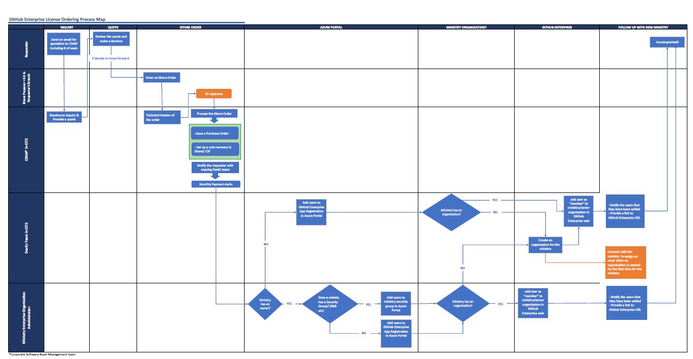

# GitHub Enterprise user licences in the BC government

>Note: This page is under review as of December 2023 and will be updated for clarity and accuracy early in 2024. 

All code by B.C. government teams should be open source by default. If you have closed-source code and still want to use GitHub, you can work temporarily in a private repository under the GitHub Enterprise licence.

For more information on our GitHub organizations and their uses, see [B.C. government organizations in GitHub](../bc-government-organizations-in-github/).

## On this page

- [Benefits of a GitHub Enterprise user licence](#benefits-of-a-github-enterprise-user-licence)
- [Enterprise account ownership](#enterprise-account-ownership)
- [Request GitHub Enterprise user licences](#request-github-enterprise-user-licences)
- [Access the GitHub Enterprise account](#access-the-github-enterprise-account)
- [Pay for the GitHub Enterprise user licences](#pay-for-the-github-enterprise-user-licences)

## B.C. government GitHub Enterprise Overview

GitHub Enterprise offers various features beyond those of the Free and Teams tiers. To find out more about the features of GitHub Enterprise, you may wish to review [GitHub's product page](https://github.com/enterprise).

There are certain notable differences between the [public facing `bcgov` GitHub organization](https://github.com/bcgov) and B.C. government's GitHub Enterprise environment. For example, the ability to create public repositories is disabled within GitHb Enterprise since with B.C. government public open source code should be in the [public `bcgov` organization](https://github.com/bcgov). 

Other details of GitHub Enterprise include the following:

* Single sign-on is provided via Azure AD (aka Entra ID)
* Login uses government-issued IDIR identities
* Users will be automatically assigned new GitHub IDs, distinct from public GitHub IDs 
* GitHub Actions is enabled
* Code Dependency Insights is enabled

## GitHub Enterprise account ownership

The B.C. government's GitHub Enterprise account is managed centrally by the Digital Office's [Developer Experience Team](mailto:developer.experience@gov.bc.ca). Ministries or sectors are provided with GitHub "organizations" within the central GitHub Enterprise account. Teams' private repositories are created within these organizations.  Management of ministry or sector organizations within GitHub Enterprise is delegated to staff within the corresponding IMB/ISB. 

Paid licenses are required to use GitHub Enterprise. Licenses must be purchased for each user that will use or administer to the B.C. government GitHub Enterprise organizations or repositories. Each ministry or sector is responsible for acquiring and paying for its own licenses. The process for acquiring licences is described below.

If you don't know whether your ministry or sector is using GitHub Enterprise or who to contact within your IMB/ISB, please [contact the Developer Experience Team](developer.experience@gov.bc.ca) for assistance.

## Acquiring GitHub Enterprise user licences

> Note: the process outlined below may be slightly different for some sectors or ministries, but it will be generally similar for all. For example, in some areas, the responsibility for interacting with CSAM may be done by the ministry or sector IMB/ISB staff rather than end users in a business area.

Licenses for GitHub Enterprise must be purchased through OCIO Software Central Management. If you have determined that you or others in your area require licenses, the first step is to request a quote via email to  [SoftwareCentral.Management@gov.bc.ca](mailto:SoftwareCentral.Management@gov.bc.ca). Use the subject line "Request for Quotation for GitHub Enterprise"  and indicate in the body the number of users who need GitHub Enterprise licenses. For example, "Could I please get a quote for 10 GitHub Enterprises licenses (Standalone)?".

Once you have received a response from CSAM with a quote number and the cost, you or someone in your business area will need to  use this to create an iStore order referencing the quote number to initiate the purchase. The usual e-approval steps will take place, and CSAM will notify you by email once they have made the purchase on your behalf. 

Once CSAM has purchased licenses on your behalf, billing back to your expense authority will commence. Billing occurs monthly until you notify CSAM to cancel the user licenses.

## Getting access to GitHub Enterprise

Once licenses have been acquired, you'll need to request access through your ministry or sector IMB to the corresponding organization within B.C. government's GitHub Enterprise environment. 

Once you've been granted access, you'll be able to log in to the B.C. government GitHub Enterprise at [https://github.com/enterprises/bcgov-ent/](https://github.com/enterprises/bcgov-ent/) using your IDIR and credentials begin working in private repositories within your ministry or sector's organization. 

## Background: BC government GitHub Enterprise process map

Our team has created the artifact below which captures the steps and teams involved in acquiring and mananaging GitHub Enterprise licenses. This version is intended for reference only, but we intend to create simplified, more focused versions for both end users and administrators.  

---
Related links:

* [BC Government Organizations in GitHub](../bc-government-organizations-in-github/)

---
