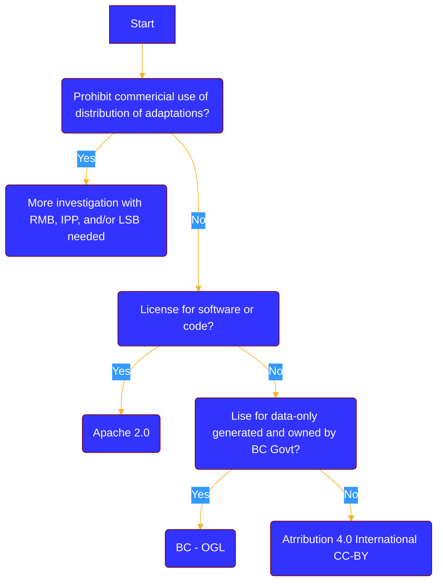
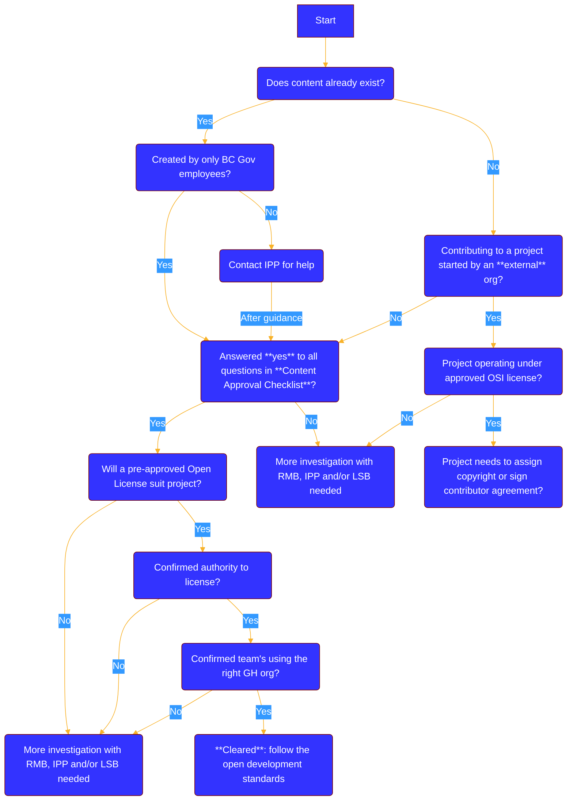

# Licenses for GitHub repos

Licences manage and share intellectual property for code and materials on GitHub. Any consumpation, shares, or contributions to a repo needs to be matched with the relevant licence. 

## 

The Intellectual Property Program **(IPP)** must approve licences of B.C. government owned intellectual property. The only **exception** is if a ministry has either specific legislative authority or Treasury Board approval that lets them license the intellectual property rights of the Province to third parties. 

When IPP is the authority for the licensing, teams must work with IPP to find the best fit to meet the licensing needs of the project.

IPP examines the development history of the content, somtetimes in the form of a conversation. Initial questions include the following:

- Is the content created solely by B.C. government employees?

- Does the content contain only content owned by the B.C. government? Have you made sure that it doesn't contain any third-party content?
- Can you confirm that there are no terms of use or exclusive licensing arrangements that prohibit the Province from posting and licensing the content on GitHub?

## Guidance for choosing a licence

Always determine if a licence attached to material restricts changes or resharing of content. If it doesn't, then the assumption of "all rights reserved" applies. It cannot be used with the explicit permission of the rights holder.

Below, we've outlined some guidelines to help teams get started.

### Contributing to a project 

Even when contributing to an existing, external project, teams must understand the licence and contributor conditions. If any project needs a copyright assignment or contributor agreement, please contact the Legal Services Branch **(LSB)** before taking any action. 

### Initiating a project 

B.C. Goverment can only license rights that it's in a legal position to grant others. If a team wants to initiate a project or release materials created prior, please make sure that government's intellectual property right are, minimally, equal to the rights under which the content will be licensed to third parties. 

Four, preferred open licences have been approved to use that most likely covers many projects: 

- [Apache 2](https://www.apache.org/licenses/LICENSE-2.0) for publishing code.

- [Creative Commons International 4.0 (CC BY)](https://creativecommons.org/licenses/by/4.0/) for other documentation, artistic resources and educational material.

- [Open Government Licence - BC (OGL-BC)](https://www2.gov.bc.ca/gov/content/data/open-data/open-government-licence-bc) for making government generated and owned data available to the public.

- [Affero General Public Licence (AGPL)](https://www.gnu.org/licenses/agpl-3.0.en.html) for works already containing that licence or for which maintaining open access to any modifications is critical.

These four licences follow a consistent licensing approach. But, if a project is better suited to a difference licence, talk about the requirements with the IPP. They can answer questions and advise on further actions. 

## Choosing a licence

The following flowcharts represent the above in a detailed, visual way. We offer the diagrams in hopes to inform, not replace, the licensing review for each project. 

The first flowchart guides a team into what could be a good fit for their project: 

The second flowchart shows questions a team could ask themselves in their assessment phase:

## Applying the licence to a project

Place the licence file for the project in the repo before anything else is done. The default license for code repositories is **Apache 2.0**.

Use the following boiler-plate text in the comments header of every source code file, as well as the bottom of the README file:

    Copyright 2019 Province of British Columbia

    Licensed under the Apache License, Version 2.0 (the "License");
    you may not use this file except in compliance with the License.
    You may obtain a copy of the License at

       http://www.apache.org/licenses/LICENSE-2.0

    Unless required by applicable law or agreed to in writing, software
    distributed under the License is distributed on an "AS IS" BASIS,
    WITHOUT WARRANTIES OR CONDITIONS OF ANY KIND, either express or implied.
    See the License for the specific language governing permissions and
    limitations under the License.

For repositories that are made up of docs, wikis or other non-code files, the default licence is Creative Commons Attribution 4.0 International. It should look like this at the bottom of the README file:

 YOUR REPO NAME HERE by the Province of British Columbia is licensed under a <a rel="license" href="http://creativecommons.org/licenses/by/4.0/">Creative Commons Attribution 4.0 International License</a>.

The code for the Creative Commons 4.0 footer looks like this:

     YOUR REPO NAME HERE by the Province of British Columbia
     is licensed under a <a rel="license" href="http://creativecommons.org/licenses/by/4.0/">
    Creative Commons Attribution 4.0 International License</a>.
