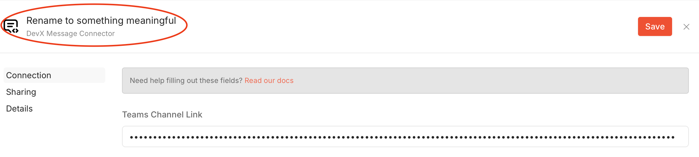
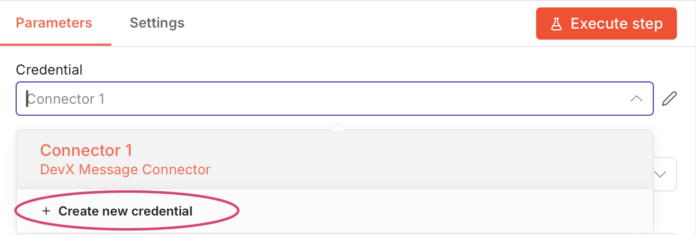
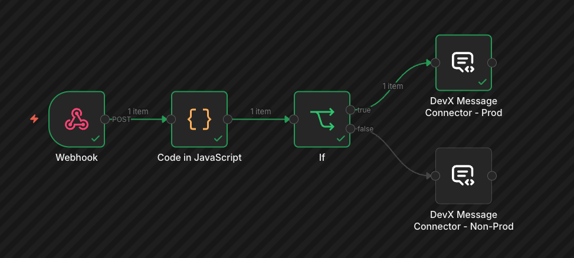
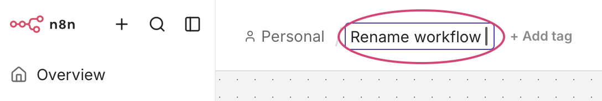

# Install Relay and create your first workflow

This walkthrough will guide you through the process to post a webhook notification to a MS Teams channel.

!!! info
    You will need to complete the [Access Requirements](./msteams-webhooks.md/#access-requirements) steps before starting this walkthrough.

In this walkthrough you will:

1. Install the Relay app in a MS Teams channel
1. Set up a workflow to accept a generic webhook
1. Send a generic webhook to your workflow

After completing the steps you will have a webhook message in your MS Teams' channel.

## Step 1: Install Relay 
Once all the [permissions are applied](./msteams-webhooks.md/#access-requirements), follow these steps to install the app:

1. Open Microsoft Teams
1. Go to **Apps**
1. Search for **Relay**
1. Select **Add**
1. Choose the channel(s) to install it in


[Refer to the troubleshooting page](./troubleshooting.md#relay-app-troubleshooting) if you have issues installing the Relay app.


## Step: 2 Set up n8n workflow

The n8n workflow will accept the incoming webhook, transform it and pass the message on to the Relay App.

A minimal n8n workflow requires two nodes:

* Webhook 
* DevX Message Connector 

Set up the Webhook node:

1. Login to [https://n8n.developer.gov.bc.ca/](https://n8n.developer.gov.bc.ca/) 
1. Click the "Create workflow" button
1. Click on the "Add first step..." icon
1. Search for "Webhook"
1. Change the HTTP Method to `POST`
1. Click the "X" button to close the node. Your changes will be automatically saved

Your workspace should look like the following:


Set up the DevX Message Connector node:

1. Click on the "+" button next to the webhook node
1. Search for "DevX Message Connector"
1. Click the "Set up Credential" button
  1. Refer to the [Add additional credentials](#add-additional-credentials) section if the "Set up Credential" button isn't available
1. In the "Teams Channel Link" field, paste the link to your team's channel
  1. The link can be found in MS Teams by clicking on the three dots next to the channel name and selecting "Copy link" 
1. Rename the Connector by clicking on the name in the top left side of the editor
1. Click Save

1. Set the "Type" dropdown to "Template"
1. Set the "Source" dropdown to "Generic"
1. Set the payload field to `{{ $json.body }}`

1. Click the "X" button to close the node. Your changes will be automatically saved

Your workspace should look like following:


### Add additional credentials

You can add more credentials by:

1. Expanding the Credential drop down box in the DevX Message Connector Node
1. Clicking the "+ Create new credential" button


## Step 3: Send a test message to workflow

The workflow has two modes, test and production. We will use the **test mode** for this walkthrough:

1. Double click on the webhook node
1. Copy the `Test URL`
1. Close the window
1. Click the "Execute workflow" button 
  1. This will put your workflow into listen mode
  1. It will listen for **ONE** event and then exit listen mode
1. Use the curl command below to send a message to your workflow.
  1. Make sure to update the {your-test-webhook-url} placeholder to the URL you copied above.

```shell
curl -X POST "{your-test-webhook-url}" \
-H "Content-Type: application/json" \
-d '{
  "title": "Demo webhook",
  "body": "This is an example webhook using the generic template. Click the button to view the documentation for the other template types.",
  "severity": "success",
  "url": "https://github.com/bcgov/common-hosted-workflow/blob/main/docs/workflow-instructions/devx-teams-message.md",
  "urlLabel": "View Documentation"
}'
```

Your MS Teams channel should now have a message like the following:


### Webhook Test vs Production URLs

**Test URL**

* Used during development 
* Requires workflow execution mode
* Only processes one request at a time
* Visible in editor logs

**Production URL**

* Active only after publishing workflow
* Runs continuously in background
* Intended for real integrations

**Recommended usage**

!!! tip "Best practice"
    * Use Test URL during workflow development
    * Use Production URL only for stable workflows across your environments

Test and Production URLs should not be used to separate production and non-production environments. 

#### Recommended approach for production and non-production notifications

* Create separate Teams channels for production and non-production notifications
* Use the webhook Production URL for both the production and non-production environments of your system.
* Use a `code` node to determine whether the alert is from the production environment or not. 
* Filter the alert with an `if` node



### Logs

The execution of your test work flow is available in the logs tab found at the bottom left of the workspace.


## Step 4: Publish the workflow

To use the webhook for production:

1. Rename the workflow by clicking on its name in the top left section of the editor
1. Click the "Publish" button in the top right section of the editor
1. Use the `Production URL` from your Webhook node to make calls to your workflow



## Next steps

* Explore additional templates types in [DevX Message Connector documentation](https://github.com/bcgov/common-hosted-workflow/blob/main/docs/workflow-instructions/devx-teams-message.md)
* Review [Onboarding guide: Microsoft Teams webhook integration](../webhooks/msteams-webhooks.md)
* Use the `Script` node between the `Webhook` and `DevX Message Connector` nodes to set up custom scripting

