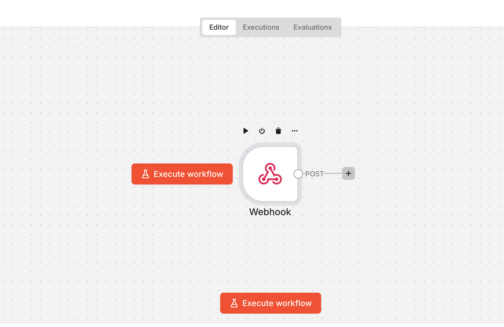

# Create your first workflow

This walkthrough will guide you through the process to post a webhook notification to a MS Teams channel.

You will need to complete the: [Access Requirements](./msteams-webhooks.md/#access-requirements) steps before starting this walkthrough.

In this walkthrough you will:

1. Understand the n8n workflow ownership model
2. Prerequisite: [Install the Relay app](./msteams-webhooks.md#relay-app-in-microsoft-teams-installation) in a MS Teams channel
3. Set up a workflow to accept a generic webhook
4. Send a generic webhook to your workflow

After completing the steps you will have a webhook message in your MS Teams' channel.

## n8n workflow ownership model
!!! Info "" 
    The n8n workflow currently runs on the Community (free) edition.

**Key limitations**

* Each workflow is owned by a single user
* Workflows cannot be shared across users
* Credentials are not shared between users
* Execution history is user-specific
 
**Recommended team approach**

Use a shared Team mailbox (IDIR account):

* Creates shared ownership of workflows
* Reduces dependency on individuals 

**Workflow portability workaround**

* Export workflow as JSON
* Import into another user or team mailbox account
* Reconfigure:
    * Credentials
    * Webhook URLs (conflicts may occur, must be reviewed)
* Admins may assist with recreation in urgent cases

The DevX or Workflow team will:

1. Add the team mailbox IDIR email to the n8n workspace
2. Export workflows from personal accounts
3. Import them into the team mailbox account 

## Step 1: Install Relay (prerequisite)
[Install the Relay app](./msteams-webhooks.md#relay-app-in-microsoft-teams-installation) in a MS Teams channel

## Step: 2 Set up n8n workflow

The n8n workflow will accept the incoming webhook, transform it and pass the message on to the Relay App.

A minimal n8n workflow requires two nodes:

* Webhook 
* DevX Message Connector 

Set up the Webhook node:

1. Login to [https://n8n.developer.gov.bc.ca/](https://n8n.developer.gov.bc.ca/) 
2. Click the "Create workflow" button
3. Click on the "Add first step..." icon
4. Search for "Webhook"
5. Change the HTTP Method to `POST`
6. Click the "X" button to close the node. Your changes will be automatically saved

Your workspace should look like the following:



Set up the DevX Message Connector node:

1. Click on the "+" button next to the webhook node
2. Search for "DevX Message Connector"
3. Set the "Credential" dropdown to "+ Create new credential"
4. In the "Teams Channel Link" field, paste the link to your team's channel
  1. The link can be found in MS Teams by clicking on the three dots next to the channel name and selecting "Copy link" 
5. Rename the Connector by clicking on the name in the top left side of the editor
6. Click Save
7. Set the "Type" dropdown to "Template"
8. Set the "Source" dropdown to "Generic"
9. Set the payload field to `{{ $json.body }}`
10. Click the "X" button to close the node. Your changes will be automatically saved

Your workspace should look like following:


### Standard workflow pattern

Most integrations follow this structure:

* Webhook -> receives event
* Optional code node -> transforms playload
* DevX Message Connector -> formats message
* Relay app -> sends alert or notification to a channel on MS Teams

## Step 3: Send a test message to workflow

The workflow has two modes, test and production. We will use the **test mode** for this walkthrough:

1. Double click on the webhook node
2. Copy the `Test URL`
3. Close the window
4. Click the "Execute workflow" button 
  1. This will put your workflow into listen mode
  2. It will listen for **ONE** event and then exit listen mode
5. Use the curl command below to send a message to your workflow.
  1. Make sure to update the {your-test-webhook} placeholder to the URL you copied above.

```shell
curl -X POST "{your-test-webhook}" \
-H "Content-Type: application/json" \
-d '{
  "title": "Demo webhook",
  "body": "This is an example webhook using the generic template. Click the button to view the documentation for the other template types.",
  "severity": "success",
  "url": "https://github.com/bcgov/common-hosted-workflow/blob/main/docs/workflow-instructions/devx-teams-message.md",
  "urlLabel": "View Documentation"
}'
```

Your MS Teams channel should now have a message like the following:


### Test vs Production URLs
Test and Production URLs should not be used to separate production and non-production environments. 

Recommended approach:

* Create separate Teams channels for production and non-production notifications
* Create separate workflows and webhooks for each environment
* Publish each workflow separately
* Configure source systems to use the appropriate Production URL

**Test URL**

* Used during development 
* Requires workflow execution mode
* Only processes one request at a time
* Visible in editor logs

**Production URL**

* Active only after publishing workflow
* Runs continuously in background
* Intended for real integrations

## Step 4: Publish the workflow

To use the webhook for production:

1. Rename the workflow by clicking on its name in the top left section of the editor for clarity
2. Click the "Publish" button in the top right section of the editor
3. Use the `Production URL` from your Webhook node to make calls to your workflow

!!! tip Best practice
    * Use Test URL for development
    * Use Production URL only for stable workflows
    * Maintain separate workflows for different environments (dev/prod)

## Troubleshooting

### Payload and JSON errors

Examples:

* Converting circular structure to JSON
* Cannot read properties of undefined (reading 'severity')

Common causes:

* Payload schema does not match expected format
* Missing required fields
* Empty payloads from test integrations
* Invalid or unexpected payload structures

Recommended solution:

1. Open the **Executions** tab in n8n
2. Inspect the incoming payload
3. Verify required fields exist
4. Add a Code node to transform or normalize payloads

### Workflow works in test but fails in production

Possible causes:

* Workflow has not been published
* Production events differ from test payloads
* Relay app is not installed in the target Teams channel

### Integration failures (Sysgid, StatusCake and similar systems)

Common issues:

* Empty payloads
* Non-standard payload formats
* Timestamp formatting differences
* Test payloads may differ from production alerts

Examples: 

* Sysdig may send blank payloads by default
* Test alerts often differ form real event payloads

Recommended solutions:

* Use standard payload templates where available
* Normalize payloads using a Code node
* Explicitly map incoming fields before sending to DevX Message Connector

### Preview shows success but no Teams message
Preview mode does not send messages. It only displays formatted output and is intended for testing. 

To send messages:

* Switch to Send mode
* Publish the workflow
* Test using Production URL if validating deployed behaviour

### Relay app behaviour and limitations

**Mentions** (@user, @group)
Mentions are not currently supported. 

Limitations:

* Relay does not process mention attributes
* @user text will not trigger notifications
* Proper mentions would require Microsoft Graph API structures, which are not currently implemented

**Open source status**

The Relay app itself is store as a Microsoft Teams manifest in a private repository. 

The DevX Message Connect API is open source:

[https://github.com/bcgov/devx-teams-connector](https://github.com/bcgov/devx-teams-connector)

## Next steps

* Explore additional templates types in [DevX Message Connector documentation](https://github.com/bcgov/common-hosted-workflow/blob/main/docs/workflow-instructions/devx-teams-message.md)
* Review [Onboarding guide: Microsoft Teams webhook integration](../webhooks/msteams-webhooks.md)
* Use the `Script` node between the `Webhook` and `DevX Message Connector` nodes to set up custom scripting

