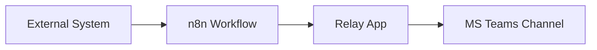

# Onboarding guide: Microsoft Teams webhook integration 

## Architecture overview 
Sending webhook events to a Microsoft Teams channel is supported via an n8n-driven pipeline and the MS Teams Relay app:

## n8n workflow
All of the following are internal components of the n8n workflow:

* Webhook node (entry point)
* Optional transformation node (e.g. Code node)
* DevX Message Connector node (format + routing logic)

![Screenshot of n8n editor. It has three nodes, Webhook, Code in Puthon and DevX Message  Connector. The webhook node has a connector arrow to the Code in Python node. The connector arrow has the label "GET" on it. Below the Code in Python node is a note stating: "Code node is optional. It can be either JavaScript or Python". There is a connector arrow on the right side of the Code in Python node pointing to the DevXMessage Connector node. The DevX Message Connector has a connector line pointing to the right. It ends in a button with a + symbol.](../images/n8n-nodes.png)

These components sit outside of n8n:

* Replay app (Microsoft Teams integration layer)
* Microsoft Teams channel (final message destination)

### Core components:

* n8n workflow 
  * Handles:
    * Receiving webhook events
    * Transforming payloads
    * Routing messages to external systems
  * Contains:
    * Webhook node
    * Optional Code node
    * DevX Message Connector node 

* Relay app
  * Receives formatted messages from n8n
  * Translates them into Teams messages
  * Posts into configured channel 

* MS Teams channel
  * Final delivery endpoint for notifications and alerts 
  * Must be configured via channel link in credentials 

### Standard workflow pattern

Most integrations follow this structure:

* Webhook -> receives event
* Optional code node -> transforms playload
* DevX Message Connector -> formats message
* Relay app -> sends alert or notification to a channel on MS Teams  

### n8n workflow ownership model
!!! Info 
    The n8n workflow currently runs on the Community (free) edition.

**Key limitations**

* Each workflow is owned by a single user
* Workflows cannot be shared across users
* Credentials are not shared between users
* Execution history is user-specific
 
**Recommended team approach**

Use a shared Team mailbox (IDIR account):

* Creates shared ownership of workflows
* Reduces dependency on individuals 

**Workflow portability workaround**

* Export workflow as JSON
* Import into another user or team mailbox account
* Reconfigure:
  * Credentials
  * Webhook URLs (conflicts may occur, must be reviewed)
* Admins may assist with recreation in urgent cases

The DevX or Workflow team will:

1. Add the team mailbox IDIR email to the n8n workspace
1. Export workflows from personal accounts
1. Import them into the team mailbox account 

## Access requirements 
Before you begin [open a ticket](https://citz-do.atlassian.net/servicedesk/customer/portal/2/group/9/create/561) to request access to the Relay app and the [n8n](https://n8n.developer.gov.bc.ca/) instance.

**Required access**

* Relay app access (via security group)
* n8n instance access: https://n8n.developer.gov.bc.ca/

!!! warning Important constraints
    * Relay app access may take up to 24 hours for the security group permissions to be applied. The app will not appear at all until this has been successfully applied
    * You must log in once to n8n before role assignments take effect
    * Channels must be **Standard** or **Shared** (Private channels are not supported)
    * You must be a Team owner to install Relay app in a channel

## Relay App in Microsoft Teams installation
Once all the permissions are applied, follow these steps to install the app:

1. Open Microsoft Teams
1. Go to **Apps**
1. Search for **Relay**
1. Select **Add**
1. Choose the channel(s) to install it in

### Common issues

[Refer to the troubleshooting page](./troubleshooting.md#relay-app-troubleshooting) if you have issues with the Relay app.

### Open source status

The Relay app itself is a Microsoft Teams manifest in a private repository. 

The DevX Message Connect API is open source:

[https://github.com/bcgov/devx-teams-connector](https://github.com/bcgov/devx-teams-connector)

## Next steps
[Create your first workflow](../webhooks/create-workflow.md)

## Further Reading
[Relay App API](https://github.com/bcgov/devx-teams-connector)
[n8n workflow DevX Message Connector](https://github.com/bcgov/common-hosted-workflow/blob/main/docs/workflow-instructions/devx-teams-message.md)

