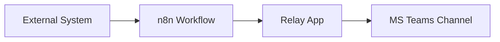

# Onboarding Guide: Microsoft Teams Webhook Integration 

## Architecture Overview 

Sending webhook events to a given Microsoft Teams channel is supported via an n8n-driven pipeline and the MS Teams Relay app:




Core components:

* n8n workflow 
  * Handles routing, transformation, and logic 
* Relay app (MS Teams) 
  * Receives messages from n8n and posts them to the MS Teams channel
* MS Teams channel 

### n8n Workflow Ownership Model 

The n8n instance currently runs on the Community edition. This means workflows:

* Are tied to a single user 
* Cannot be shared across users 
* Do not share credentials or execution history

The recommended pattern is to have team-based ownership by using a team mailbox account instead of an individual account to access n8n.


## Access Requirements 

[Open a ticket](https://citz-do.atlassian.net/servicedesk/customer/portal/2/group/9/create/561) to request access to the Relay app and the [n8n](https://n8n.developer.gov.bc.ca/) instance.

Requirements:

* The person with access to the Relay app **must** be an owner of the MS Teams team where the app will be installed.
  * Access to the Relay app can take up to 24 hours.
* The channel where notifications are sent must be either a `Standard` or `Shared` channel, **not** a `Private` channel.
* The people with access to n8n will be responsible for setting up the n8n workflows.
  * A shared team email that is associated with an IDIR can be used to create and manage workflows instead. 
  * This will associate the workflow with the shared user rather than an individual user.

## Creating Your First Workflow

This walkthrough will guide you through the process to post a webhook notification to a MS Teams channel.

You will need to complete the [Access Requirements](#access-requirements) steps before starting this walkthrough.

In this walkthrough you will:

1. Install the Relay app in a MS Teams channel
1. Set up a workflow to accept a generic webhook
1. Send a generic webhook to your workflow

After completing the steps you will have a webhook message in your MS Teams' channel.

### Install the Relay App in MS Teams 

The Relay app will appear in the MS Teams Apps menu after the access permissions have been applied. This can take up to 24 hours.

Once the permissions are applied, follow these steps to install the app:

1. Click the "Apps" button in the MS Teams side menu 
1. Click "Add" on the Relay app 
1. Select which channel(s) the app should be installed to


### Set Up n8n Workflow

The n8n workflow will accept the incoming webhook, transform it and pass the message on to the Relay App.

A minimal n8n workflow requires two nodes:

* Webhook 
* DevX Message Connector 


Set up the Webhook node:

1. Login to [https://n8n.developer.gov.bc.ca/](https://n8n.developer.gov.bc.ca/) 
1. Click the "Create workflow" button
1. Click on the "Add first step..." icon
1. Search for "Webhook"
1. Change the HTTP Method to `POST`
1. Click the "X" button to close the node. Your changes will be automatically saved

Your workspace should look like the following:


Set up the DevX Message Connector node:

1. Click on the "+" button next to the webhook node
1. Search for "DevX Message Connector"
1. Set the "Credential" dropdown to "+ Create new credential"
1. In the "Teams Channel Link" field, paste the link to your team's channel
    1. The link can be found in MS Teams by clicking on the three dots next to the channel name and selecting "Copy link" 
1. Rename the Connector by clicking on the name in the top left side of the editor
1. Click Save
1. Set the "Type" dropdown to "Template"
1. Set the "Source" dropdown to "Generic"
1. Set the payload field to `{{ $json.body }}`
1. Click the "X" button to close the node. Your changes will be automatically saved

Your workspace should look like following:


### Send Message To Workflow

The workflow has two modes, test and production. We will use the test mode for this walk through.

1. Double click on the webhook node
1. Copy the `Test URL`
1. Close the window
1. Click the "Execute workflow" button 
    1. This will put your workflow into listen mode
    1. It will listen for **ONE** event and then exit listen mode
1. Use the curl command below to send a message to your workflow.
    1. Make sure to update the {your-test-webhook} placeholder to the URL you copied above.

```shell
curl -X POST "{your-test-webhook}" \
-H "Content-Type: application/json" \
-d '{
  "title": "Demo webhook",
  "body": "This is an example webhook using the generic template. Click the button to view the documentation for the other template types.",
  "severity": "success",
  "url": "https://github.com/bcgov/common-hosted-workflow/blob/main/docs/workflow-instructions/devx-teams-message.md",
  "urlLabel": "View Documentation"
}'
```

Your MS Teams channel should now have a message like the following:


### Troubleshooting

Refer to the [FAQ](./faq-msteams-webhooks.md) to help resolve issues.

### Publish The Workflow

To use the webhook for production:

1. Rename the workflow by clicking on its name in the top left section of the editor
1. Click the "Publish" button in the top right section of the editor
1. Use the `Production URL` from your Webhook node to make calls to your workflow


## Next Steps

* Read the [documentation](https://github.com/bcgov/common-hosted-workflow/blob/main/docs/workflow-instructions/devx-teams-message.md) to learn about other template types
* Read the [FAQ](./faq-msteams-webhooks.md)  
* Use the `Script` node between the `Webhook` and `DevX Message Connector` nodes to set up custom scripting


