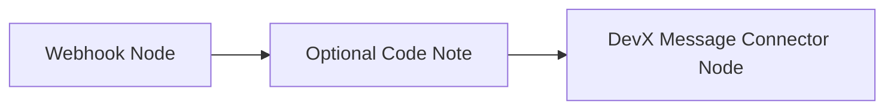

# Onboarding guide: Microsoft Teams webhook integration 

## Architecture overview 
Sending webhook events to a Microsoft Teams channel is supported via an n8n-driven pipeline and the MS Teams Relay app:

## n8n workflow (single system boundary)
All of the following are internal components of the n8n workflow:
* Webhook node (entry point)
* Optional transformation node (e.g. Code node)
* DevX Message Connector node (format + routing logic)

These components sit outside of n8n:
* Replay app (Microsoft Teams integration layer)
* Microsoft Teams channel (final message destination)

### Core components:

* n8n workflow (single system boundary)
Handles:
  * Receiving webhook events
  * Transforming payloads
  * Routing messages to external systems
Contains:
  * Webhook node
  * Optional Code node
  * DevX Message Connector node 

* Relay app (MS Teams - external integration layer) 
  * Receives formatted messages from n8n
  * Translates them into Teams messages
  * Posts into configured channel 

* MS Teams channel (destination)
  * Final delivery endpoint for notifications and alerts 
  * Must be configured via channel link in credentials 

## Access requirements 
Before you begin [open a ticket](https://citz-do.atlassian.net/servicedesk/customer/portal/2/group/9/create/561) to request access to the Relay app and the [n8n](https://n8n.developer.gov.bc.ca/) instance.

**Required access**
* Relay app access (via security group)
* n8n instance access: https://n8n.developer.gov.bc.ca/

!!! warning Important constraints
    * Relay app access may take up to 24 hours for the security group permissions to be applied. The app will not appear at all until this has been successfully applied
    * You must log in once to n8n before role assignments take effect
    * Channels must be **Standard** or **Shared** (Private channels are not supported)
    * You must be a Team owner to install Relay app in a channel

## Relay App in Microsoft Teams installation
Once all the permissions are applied, follow these steps to install the app:

1. Open Microsoft Teams
2. Go to **Apps**

3. Search for **Relay**
4. Select **Add**
5. Choose the channel(s) to install it in

### Common issues

**Relay app not visible**

* Ensure you are in the Relay security group
* Wait up to 24 hours for propagation
* Restart Teams or clear cache if needed

**Permission denied when installing**

* You must be a Team owner 
* Ask a Team owner to complete installation 

## Next steps
[Create your first workflow](../webhooks/create-workflow.md)

