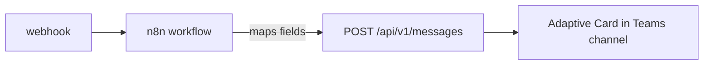

# Webhook Mapping to Adaptive Cards

This page outlines the how incoming webhook fields are mapped to the Adaptive Card output that is posted to MS Teams

## Who calls this API

The Relay API does **not** receive webhooks directly. n8n receives the webhook (GitHub, Sysdig, StatusCake, uptime, etc.), maps the payload into a template
described below, and posts it to the specified Teams channel.



### Relay API Content kinds

```jsonc
{ "kind": "text", "text": "Deployment complete" }              // 1–10000 chars
{ "kind": "html", "text": "<b>Deployment</b> complete" }       // 1–10000 chars
{ "kind": "template", "template": "<name>", "data": { ... } }  // see below
{ "kind": "card", "card": { "type": "AdaptiveCard", ... } }    // see below
```

Valid template names: `generic`, `github_pull_request`, `github_workflow_run`,
`sysdig`, `uptime`, `db_backup`, `statuscake`.

Each template section below shows the **upstream payload n8n receives**, so you
can replay it with `curl` against the n8n webhook URL.

---

## Generic

Catch-all card for sources with no dedicated template.

| Field | Required | Type / rules | Notes |
| --- | --- | --- | --- |
| `title` | yes | string, 1–200 | Card headline |
| `body` | no | string, ≤ 2000 | Body text |
| `severity` | no | `critical` \| `warning` \| `info` \| `success` \| `error` \| `debug` \| `unknown` \| `trace` | Drives the colour/badge; defaults to `info`, which renders no badge |
| `url` | no | URL | Adds an action button |
| `urlLabel` | no | string | Button label; defaults to `View Details` |
| `source` | no | string | Origin, shown under the title |

```json
{
  "title": "Nightly backup finished",
  "body": "Processed 11,021 records.",
  "severity": "success",
  "url": "https://example.com/run/42",
  "urlLabel": "View run",
  "source": "bcgov/my-repo"
}
```

---

## `GitHub Pull Request`

| Field | Required | Type / rules | Source field (GitHub webhook) |
| --- | --- | --- | --- |
| `event` | yes | string | `action` — e.g. `opened`, `closed`, `reopened` |
| `title` | yes | string, 1–200 | `pull_request.title` |
| `repo` | yes | string | `repository.full_name` |
| `author` | yes | string | `pull_request.user.login` |
| `url` | yes | URL | `pull_request.html_url` |
| `body` | no | string | `pull_request.body` (truncated to 300 chars on the card) |

```json
{
  "action": "opened",
  "pull_request": {
    "title": "Adapter module refactor",
    "html_url": "https://github.com/bcgov/my-repo/pull/42",
    "body": "Refactor adapter code prior to swapping modules",
    "user": {
      "login": "octocat"
    }
  },
  "repository": {
    "full_name": "bcgov/my-repo"
  }
}
```

---

## `GitHub Workflow Run`

| Field | Required | Type / rules | Source field (GitHub webhook) |
| --- | --- | --- | --- |
| `event` | yes | string | `action` — `completed`, `requested`, `in_progress` |
| `conclusion` | no | string | `workflow_run.conclusion` — e.g. `success`, `failure`, `timed_out`, `cancelled` |
| `workflow` | yes | string, 1–200 | `workflow_run.name` |
| `repo` | yes | string | `repository.full_name` |
| `branch` | yes | string | `workflow_run.head_branch` |
| `author` | yes | string | `workflow_run.triggering_actor.login` |
| `url` | yes | URL | `workflow_run.html_url` |
| `sha` | no | string | `workflow_run.head_sha` — shorten to 7 chars in n8n |
| `message` | no | string | `workflow_run.head_commit.message` (truncated to 300 chars on the card) |

```json
{
  "action": "completed",
  "workflow_run": {
    "name": "CI",
    "conclusion": "failure",
    "head_branch": "main",
    "head_sha": "a1b2c3d4e5f60718293a4b5c6d7e8f9012345678",
    "html_url": "https://github.com/bcgov/my-repo/actions/runs/123",
    "triggering_actor": {
      "login": "octocat"
    },
    "head_commit": {
      "message": "Fix integration test"
    }
  },
  "repository": {
    "full_name": "bcgov/devx-teams-connector"
  }
}
```

---

## `sysdig`

| Field | Required | Type / rules | Source field (Sysdig webhook) |
| --- | --- | --- | --- |
| `severity` | yes | integer 0–7 | `alert.severity` — 0 critical, 1 high, 2–3 medium, 4–5 low, 6–7 info |
| `alertName` | yes | string, 1–200 | `alert.name` |
| `subject` | no | string, 1–500 | `alert.subject` |
| `state` | no | `ACTIVE` \| `OK` | `state` — lowercase `active`/`ok` are accepted and normalised to uppercase |
| `scope` | no | string | `alert.scope` |
| `description` | no | string | `alert.description` |
| `timestamp` | no | ISO 8601 | `timestamp` |
| `url` | no | URL | `alert.editUrl` |

```json
{
  "alert": {
    "severity": 0,
    "name": "High memory usage",
    "subject": "Pod api-7f9 memory > 90%",
    "scope": "kubernetes.namespace.name = prod",
    "description": "Memory usage exceeded the configured threshold.",
    "editUrl": "https://app.sysdigcloud.com/#/alerts/123"
  },
  "state": "ACTIVE",
  "timestamp": "2025-01-15T10:30:00Z"
}
```

---

## `uptime`

| Field | Required | Type / rules | Source field |
| --- | --- | --- | --- |
| `status` | yes | `up` \| `down` | `data.alert.is_up` — boolean, convert to `"up"`/`"down"` in n8n |
| `service` | yes | string | `data.service.display_name` |
| `downSince` | no | ISO 8601 | `data.alert.created_at` |
| `url` | no | URL | `data.links.alert_details` |

```json
{
  "data": {
    "alert": {
      "is_up": false,
      "created_at": "2025-01-15T10:30:00Z"
    },
    "service": {
      "display_name": "api.example.com"
    },
    "links": {
      "alert_details": "https://uptime.example.com/alerts/9"
    }
  }
}
```

---

## `statuscake`

| Field | Required | Type / rules | Source field (StatusCake) |
| --- | --- | --- | --- |
| `status` | yes | `up` \| `down` | `Status` |
| `testName` | yes | string | `Name` |
| `websiteUrl` | no | URL | `URL` |
| `statusCode` | no | string | `StatusCode` |
| `ip` | no | string | `IP` |
| `tags` | no | string | `Tags` |
| `checkRate` | no | string | `Checkrate` |
| `testId` | no | string | `TestID` |
| `method` | no | string | `Method` |

```json
{
  "Name": "platform alerts",
  "Status": "DOWN",
  "URL": "https://example.com",
  "StatusCode": "503",
  "IP": "127.0.0.1",
  "Tags": "prod,web",
  "Checkrate": "300",
  "TestID": "1234567",
  "Method": "Website"
}
```

---

## `db_backup`

| Field | Required | Type / rules | Source field |
| --- | --- | --- | --- |
| `status` | yes | `info` \| `warn` \| `error` | `statusCode` |
| `projectName` | yes | string | `projectName` |
| `projectFriendlyName` | yes | string | `projectFriendlyName` |
| `message` | no | string | `message` |

```json
{
  "statusCode": "error",
  "projectName": "abc123-prod",
  "projectFriendlyName": "bcgov Policy Hub (Prod)",
  "message": "Backup failed: connection refused."
}
```

---

## `Adaptive Card`

Adaptive Cards can also be passed in directly. Only `type: "AdaptiveCard"` is checked, then the card is forwarded to Teams.

```json
{
  "type": "AdaptiveCard",
  "$schema": "http://adaptivecards.io/schemas/adaptive-card.json",
  "version": "1.5",
  "body": [
    {
      "type": "TextBlock",
      "text": "Deployment complete",
      "weight": "Bolder"
    },
        {
      "type": "TextBlock",
      "text": "The deployment completed successfully",
      "weight": "Default"
    }
  ],
  "actions": [
    {
      "type": "Action.OpenUrl",
      "title": "Open runbook",
      "url": "https://example.com/runbook"
    }
  ],
  "fallbackText": "Deployment complete"
}
```
