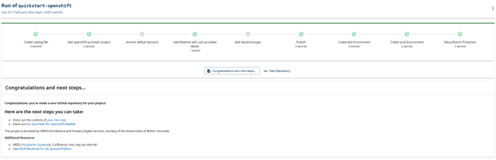

# DevHub Wizards

Welcome to the DevHub Wizard, a tool that streamlines application deployment to OpenShift! We built it based on the starter application of NRS' QuickStart for OpenShift, which you can find [here](). 

DevHub Wizards works in tandem with Product Registry. Filling out a quick form creates a new GitHub repo within ten seconds.

<h2>Product Registry: Namespace</h2>

A user **must** create an entry in Product Registry before using DevHub Wizards because the process gives the namespace in OpenShift. 

The naming convention is standardized, following the same format as Product Registry: a product set licence plate followed by "-dev", "-test", "-prod", or "-tools". Once completed, users can deploy an app wireframe through DevHub Wizards.

Aside from generated namespaces, we don’t have standardized naming conventions for GitHub repositories.     

## Video demo of DevHub Wizards

We created both a video and a step-by-step walkthrough below, so users feel prepared beforehand. 

<iframe width="560" height="315" src="https://www.youtube.com/embed/9IiLW1864hs?si=xhcQyxv9yRJUJMf3" title="YouTube video player" frameborder="0" allow="accelerometer; autoplay; clipboard-write; encrypted-media; gyroscope; picture-in-picture; web-share" referrerpolicy="strict-origin-when-cross-origin" allowfullscreen></iframe>

## Walkthrough

### Step 1

Mandatory information from the title, description, product category, and product lifecycle integrates into the GitHub repo read.me and become **metadata**. The catalogue **.yaml** file stores the metadata in the new repo. 

### Step 2

The Ministry field categorizes government repos. By doing this, we don’t lose track of repositories. The metadata fields (Product name, acronym and Product owner) give needed information to link GitHub repositories with product teams. 

 
### Step 3
 
The ‘Select the backend stack’ field defaults to JavaScript/TypeScript because it’s bundled with the QuickStart for OpenShift project. There are other alternative backend examples that can offer starting points for your team. Currently, DevHub Wizards is only available for the Gold and Silver clusters. 

Step 5 is for **dev** environment OC_Namespace and OC_Token.

### Step 4

Step 4 is for **test** environment OC_Namespace and OC_Token.

 
### Step 5

Step 5 is for **prod** environment OC_Namespace and OC_Token.

 
### Step 6

If you haven't enabled Single Sign-On (SSO), Step 6 will prompt log in.

DevHub Wizards can only create GitHub repositories for the bcgov organization. The Repository field creates the GitHub repo title. Choosing which team the GitHub repo belongs to is for administration.  

### Step 7

The Review button takes users to verify the inputted information. At this point, users have the option to go back to any of the steps prior to adjust any information. After clicking the ‘Create’ button, users cannot return to previous fields. 

### Step 8

After the flash animation, users have the option to visit their repo by clicking the ‘New Repository’ button. Any needed changes can be done directly on GitHub.

